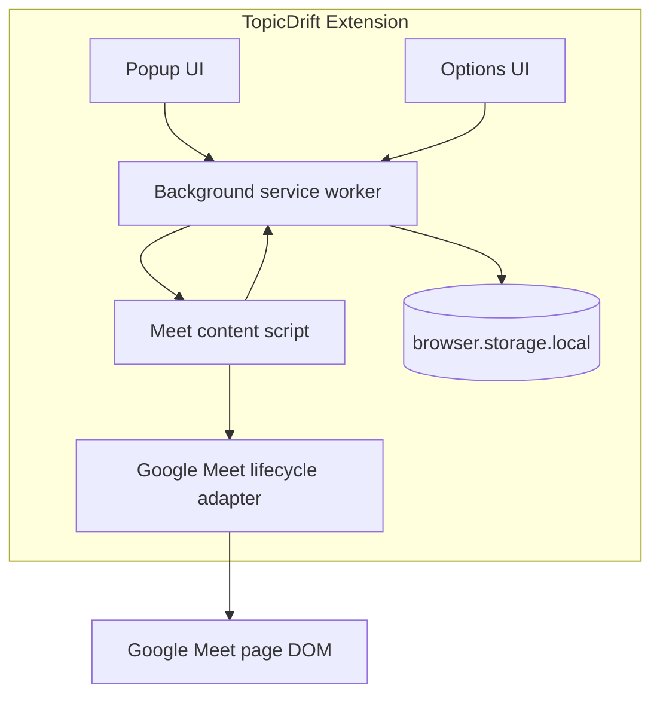
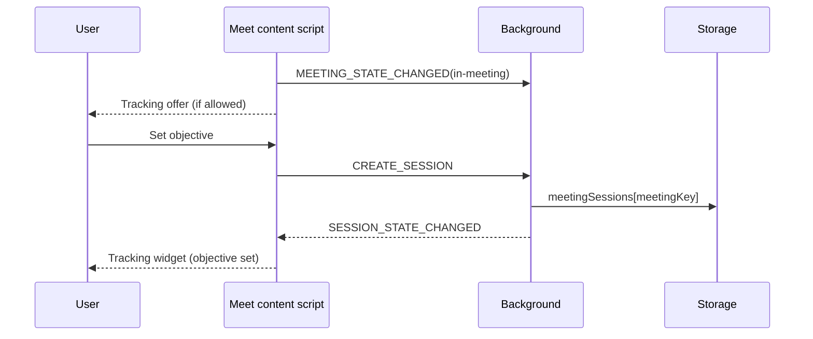

# Architecture — TopicDrift

## System overview

TopicDrift is a Manifest V3 Chrome extension built with WXT and React. Runtime logic is split across:

- a **background service worker** for typed message routing and session persistence
- a **content script** on Google Meet for lifecycle detection and in-meeting UI
- **popup** and **options** pages for status and settings
- **pure analysis modules** (stubbed) and a **web worker** placeholder
- **platform adapters** encapsulating Google Meet DOM specifics

There is no backend in v1.

## Major runtime components



## Data flow (objective/session phase)

1. Content script lifecycle detector emits `MeetingStateObservation` updates.
2. Background caches per-tab runtime state and persists sessions by `meetingKey`.
3. When stable `in-meeting` and settings allow, content script shows tracking offer.
4. User submits objective → background creates `MeetingSession` in storage.
5. Content script renders tracking widget (objective status only).
6. Popup reads cached state and can forward setup/resume/control actions to the active tab.

**Not implemented:** caption observation, worker analysis, drift alerts.

## Entrypoint responsibilities

| Entrypoint          | Responsibility                                                        |
| ------------------- | --------------------------------------------------------------------- |
| `background.ts`     | Typed routing, session CRUD, tab runtime cache, popup state           |
| `content/MeetApp`   | Lifecycle wiring, offer/objective/widget UI in shadow root            |
| `popup/App.tsx`     | Meet/session status and manual setup controls                         |
| `options/App.tsx`   | Local settings UI backed by storage service                           |

## Meeting adapter boundary

Google Meet lifecycle logic lives under `src/adapters/google-meet/`:

- `meeting-key.ts` — privacy-safe room code extraction
- `lifecycle-signals.ts` — composable DOM/URL heuristics
- `lifecycle-detector.ts` — observer-backed state emission

Caption observation stubs remain in `caption-observer.ts` but are not activated.

## Storage boundary

| Key | Contents |
| --- | -------- |
| `userSettings` | Options preferences |
| `meetingSessions` | `Record<meetingKey, MeetingSession>` |
| `offerSuppression` | Per-meeting automatic offer suppression |

Session transitions are validated in `session-transitions.ts` and persisted through `session-storage.ts`.

## Chrome message-passing approach

Typed discriminated unions in `src/types/messages.ts`. Content script publishes `MEETING_STATE_CHANGED`; background broadcasts `SESSION_STATE_CHANGED`. Popup uses `GET_POPUP_STATE` and action messages (`START_OBJECTIVE_SETUP`, `RESUME_SESSION`, etc.).

## Session lifecycle

```text
landing/prejoin
  → stable in-meeting
  → offer (optional)
  → objective setup
  → active session ↔ paused
  → stopped by user OR ended when meeting leaves in-meeting
```

## Objective/session sequence



## Error-handling approach

- Settings/sessions: normalize + fallback on read errors
- Actions return typed `Result` failures (`objective-required`, `session-not-found`, etc.)
- UI shows short user-facing errors without stack traces
- Logger redacts objective text and meeting identifiers

## Future extension points

Analysis worker, caption pipeline, and drift UI remain behind existing module boundaries. Zoom/Teams would add adapters without changing session storage shape.
