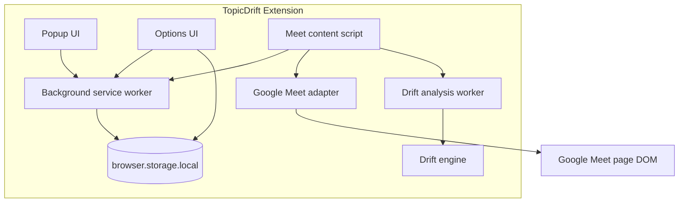
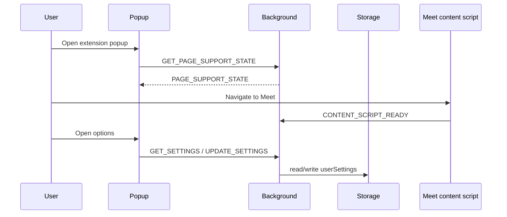

# Architecture — TopicDrift

## System overview

TopicDrift is a Manifest V3 Chrome extension built with WXT and React. Runtime logic is split across:

- a **background service worker** for installation and typed message routing
- a **content script** on Google Meet for isolated UI and future caption observation
- **popup** and **options** pages for status and settings
- **pure analysis modules** and a **web worker** for local drift scoring
- **platform adapters** encapsulating Google Meet DOM specifics

There is no backend in v1.

## Major runtime components

## Data flow (target end state)

1. Content script detects Meet meeting via adapter.
2. User opts in and supplies objective in isolated UI.
3. Adapter emits caption observations as `TranscriptSegment` objects.
4. Segments append to a rolling window and post to analysis worker.
5. Worker returns `DriftResult` using drift engine + state machine.
6. Content script renders private `DriftAlert` when sustained drift occurs.
7. Session manager coordinates lifecycle and optional summary persistence.

**Foundation today:** steps 1 and settings persistence are partially wired; steps 2–7 are stubs.

## Entrypoint responsibilities

| Entrypoint          | Responsibility                                                        |
| ------------------- | --------------------------------------------------------------------- |
| `background.ts`     | `onInstalled`, typed `runtime.onMessage` routing, settings read/write |
| `content/index.tsx` | Shadow-root UI mount on Meet, future adapter/worker wiring            |
| `popup/App.tsx`     | Product identity, page support state, options link                    |
| `options/App.tsx`   | Local settings UI backed by storage service                           |

## Meeting adapter boundary

`MeetingAdapter` (`src/adapters/meeting-adapter.ts`) defines:

- `detectMeeting()`
- `startCaptionObservation(onCaption)` — must only run after user activation
- `dispose()`

Google Meet implementation lives under `src/adapters/google-meet/`. DOM selectors are centralized in `selectors.ts`.

## Transcript pipeline boundary

Caption text becomes `TranscriptSegment` objects with normalized text. The pipeline must never log raw text in production and should avoid persisting raw segments by default.

## Analysis engine boundary

`src/analysis/` contains pure functions and classes:

- text normalization and TF-IDF utilities
- rolling transcript window
- similarity scoring
- drift state machine (sustained vs transient)
- `analyzeDrift()` orchestrator

No imports from `chrome.*`, `browser.*`, or DOM APIs are permitted here.

## UI boundary

React components under `src/components/` render drift alerts, objective forms, tracking widgets, and summaries inside shadow roots. Styles must not leak into Meet and Meet CSS must not break TopicDrift.

## Storage boundary

`src/services/storage.ts` persists `UserSettings` only in v1 foundation. Future session summaries and temporary session metadata must respect user settings and privacy docs.

## Chrome message-passing approach

Typed discriminated unions in `src/types/messages.ts`. Handlers are registered via `createMessageRouter()` in the background. Popup/options call `browser.runtime.sendMessage` through `src/services/messaging.ts`.

## Worker strategy

`src/workers/drift-analysis.worker.ts` will run CPU-bound scoring off the main thread. Content script posts analysis jobs; worker returns `DriftResult` payloads.

## Session lifecycle

`SessionManager` tracks in-memory session state:

`detected → offer → awaiting-objective → tracking → paused/ended`

Foundation provides class scaffolding without full wiring.

## Error-handling approach

- Settings: normalize + fallback to defaults on read errors
- Messaging: log at debug/warn without sensitive payloads
- UI: explicit loading/saving/error states on options page
- Analysis: return neutral initializing result until sufficient input exists

## Future extension points

| Platform        | Approach                                             |
| --------------- | ---------------------------------------------------- |
| Zoom            | `src/adapters/zoom/` implementing `MeetingAdapter`   |
| Teams           | `src/adapters/teams/` implementing `MeetingAdapter`  |
| Shared analysis | Unchanged `src/analysis/` modules                    |
| Shared UI       | Reuse `src/components/` with platform-agnostic props |

Add host permissions and ADR entries per platform; never copy Meet selectors into other modules.

## Foundation diagram (implemented shell)

