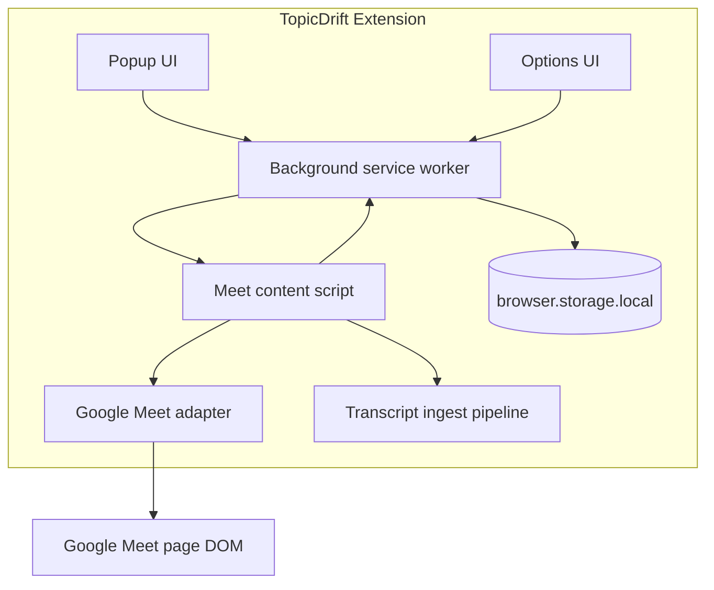

# Architecture — TopicDrift

## System overview

TopicDrift is a Manifest V3 Chrome extension built with WXT and React. Runtime logic is split across:

- a **background service worker** for typed message routing and session persistence
- a **content script** on Google Meet for lifecycle detection, caption ingestion, and in-meeting UI
- **popup** and **options** pages for status and settings
- **pure analysis modules** (stubbed) and a **web worker** placeholder
- **platform adapters** encapsulating Google Meet DOM specifics

There is no backend in v1.

## Major runtime components



## Data flow (caption phase)

1. Content script lifecycle detector emits `MeetingStateObservation` updates.
2. Background caches per-tab runtime state and persists sessions by `meetingKey`.
3. When stable `in-meeting` and settings allow, content script shows tracking offer.
4. User submits objective → background creates `MeetingSession` in storage.
5. User explicitly grants caption consent (separate from starting a session).
6. When consented and captions are visible, adapter-local `MutationObserver` ingests caption updates.
7. `TranscriptIngest` normalizes and deduplicates segments in memory only.
8. Widget and popup report caption-tracking state without drift claims.

**Not implemented:** drift scoring, worker analysis, drift alerts.

## Entrypoint responsibilities

| Entrypoint        | Responsibility                                                        |
| ----------------- | --------------------------------------------------------------------- |
| `background.ts`   | Typed routing, session CRUD, caption consent persistence, popup state |
| `content/MeetApp` | Lifecycle wiring, consent UI, caption observer orchestration          |
| `popup/App.tsx`   | Meet/session/caption status and manual controls                       |
| `options/App.tsx` | Local settings UI backed by storage service                           |

## Meeting adapter boundary

Google Meet logic lives under `src/adapters/google-meet/`:

- `meeting-key.ts` — privacy-safe room code extraction
- `lifecycle-signals.ts` — composable DOM/URL heuristics
- `lifecycle-detector.ts` — observer-backed state emission
- `lifecycle-diagnostics.ts` — development-only signal summaries
- `selectors.ts` — centralized Meet DOM selectors
- `caption-parser.ts` — caption node parsing without exposing DOM externally
- `caption-observer.ts` — `MutationObserver` for caption container and lines

## Caption consent and gating

Caption observation starts only when all are true:

- page state is `in-meeting`
- session status is `active`
- `captionConsent === 'granted'`
- captions are available in the Meet DOM

Observation stops on pause, stop, revoke, meeting end, room navigation, or content-script unload.

Only `captionConsent` is persisted for recovery. Captured transcript segments remain in memory.

## Development diagnostics

Development builds expose:

- lifecycle signal summary (no objective text, URLs, meeting codes, or participant info)
- transcript monitor counters (segment count, duplicate/partial counts, observer state)

Raw caption text is not shown by default. A dev-only toggle exists but does not render transcript content.

## Storage boundary

| Key                | Contents                                |
| ------------------ | --------------------------------------- |
| `userSettings`     | Options preferences                     |
| `meetingSessions`  | `Record<meetingKey, MeetingSession>`    |
| `offerSuppression` | Per-meeting automatic offer suppression |

`MeetingSession` may include `captionConsent` (`not-requested`, `declined`, `granted`, `revoked`).

## Chrome message-passing approach

Typed discriminated unions in `src/types/messages.ts`. Content script publishes `MEETING_STATE_CHANGED` and `CAPTION_STATE_CHANGED`; background broadcasts `SESSION_STATE_CHANGED`. Caption consent uses `GRANT_CAPTION_CONSENT` / `DECLINE_CAPTION_CONSENT`.

## Session lifecycle

```text
landing/prejoin
  → stable in-meeting
  → offer (optional)
  → objective setup
  → active session
  → explicit caption consent
  → caption observation (in-memory transcript)
  ↔ paused
  → stopped by user OR ended when meeting leaves in-meeting
```

## Error-handling approach

- Settings/sessions: normalize + fallback on read errors
- Actions return typed `Result` failures (`objective-required`, `session-not-found`, etc.)
- UI shows short user-facing errors without stack traces
- Logger redacts objective text, transcript text, and meeting identifiers

## Future extension points

Drift engine, worker offload, and summaries remain behind existing module boundaries. Zoom/Teams would add adapters without changing session storage shape.
